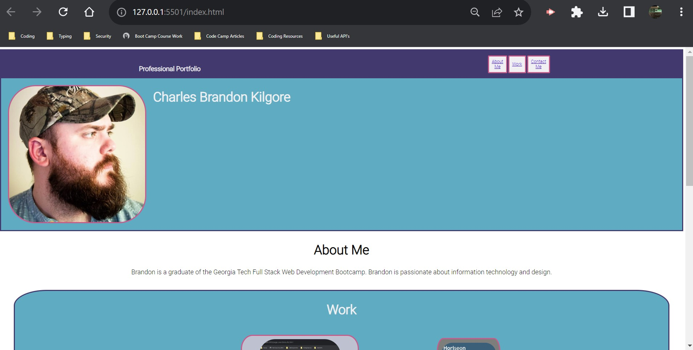
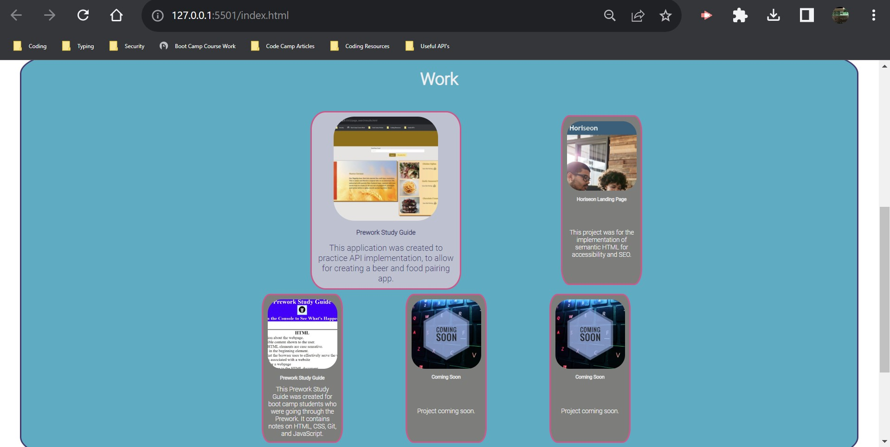
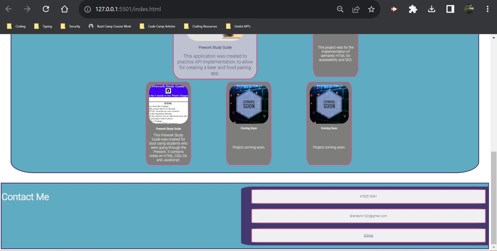

# Professional-Portfolio

## Description

The reason for starting and building this project, was to create a portfolio landing page for future use.  Allowing me to have on condenced location to direct those who may need to view or gain access to my work.  This would allow me to easily and more efficiently share my work with others. In doing doing this project, I was able to further work on my CSS, and Flexbox basics.  I was able to learn more about coding layouts and style sheet mechanics.

## Table of Contents

- [Installation](#installation)
- [Usage](#usage)
- [Credits](#credits)
- [License](#license)

## Installation

No extra steps are need for installation of the site.  The user only needs to click on the deployment link and open in browser.

## Usage

To use the portfolio site the user only needs to click on the deployment link.  Once opened in their browser,  the name section with navigation links will be presented first.

The user can then select what section of the page they would like to be taken to.  They can select from the "About Me", "Work", and "Contact Me" sections to navigate to.

When in the work section the user can then click on the project they would like to view and are taken to that project's deployment link to view it.  They are also provided with brief decscription of the project as well.

The user is also present with a contact me section, where they can locate the contact information.

## Deployed Link

Deployed URL:
https://github.com/Brandonk1023/Professional-Portfolio

## Credits

GitHub Repositories Linked:

Horiseon-Landing-Page - 
https://github.com/Brandonk1023/Horiseon-Landing-Page

Prework-Study-Guide - 
https://github.com/Brandonk1023/prework-study-guide

Image Color Picker: Used for color codes - 
https://imagecolorpicker.com/

Google Font:Roboto - 
https://fonts.google.com/specimen/Roboto

Common Media Query Break Points -
https://www.w3schools.com/howto/howto_css_media_query_breakpoints.asp

## License

MIT License
